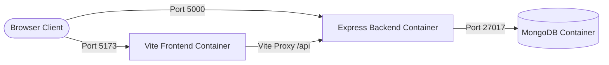
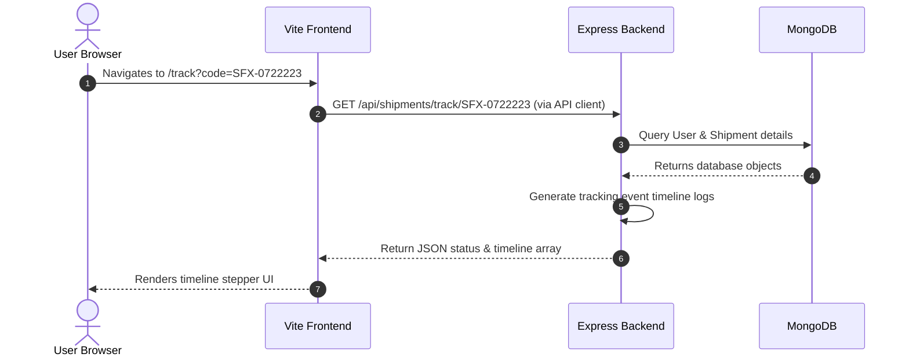

# Stage 1: Project Architecture Review

This document provides a thorough audit of the **ShipFlowX** monorepo directory layout, Docker container readiness, environment variable configurations, and data flow architectures. We analyze current pitfalls and recommend changes to make the project ready for enterprise cloud deployments on Microsoft Azure.

---

## 1. Current Folder Structure

The current layout of the ShipFlowX monorepo is shown below:

```text
ShipFlowX/
├── backend/
│   ├── config/
│   │   └── db.js                 # MongoDB connection config
│   ├── controllers/              # REST controllers
│   ├── middleware/               # Auth & role-based middleware
│   ├── models/                   # Mongoose Database Schemas
│   ├── routes/                   # Endpoint routers
│   ├── Dockerfile                # Dev-centric Node Docker configuration
│   ├── server.js                 # Express entry-point
│   └── reset-admin-password.js   # DB seed utility script
├── frontend/
│   ├── src/                      # React source code
│   │   ├── components/           # Reusable UI widgets
│   │   └── pages/                # Page route views
│   ├── Dockerfile                # Dev-centric Vite Docker configuration
│   ├── tailwind.config.js        # CSS utility system configuration
│   └── vite.config.js            # Build/proxy manager configuration
├── scripts/
│   └── check-users.js            # DB user check script
├── docker-compose.yml            # Local environment multi-container conductor
└── README.md                     # Project documentation
```

### Key Observations
* **Monorepo Layout**: Clean separation between frontend (React) and backend (Express) codes.
* **Missing DevOps Folders**: There are no directories configured for Infrastructure as Code (Terraform), Kubernetes manifests, or CI/CD pipelines (Azure DevOps). We will establish these in subsequent stages.

---

## 2. Configuration Files Inspected

* **[docker-compose.yml](file:///c:/Users/Varun%20B/OneDrive/Desktop/Projects/ShipFlowX/docker-compose.yml)**: Conducts three services: `mongodb`, `backend`, and `frontend`. Uses bind mounts (`./backend:/app`) to enable hot-reloads during local development.
* **[backend/Dockerfile](file:///c:/Users/Varun%20B/OneDrive/Desktop/Projects/ShipFlowX/backend/Dockerfile)**: Multi-step builder that pulls `node:18-alpine`, copies dependencies, and boots using nodemon (`npm run dev`).
* **[frontend/Dockerfile](file:///c:/Users/Varun%20B/OneDrive/Desktop/Projects/ShipFlowX/frontend/Dockerfile)**: Copies package lists, runs npm install, and exposes the Vite dev server on port `5173`.

---

## 3. Code & Configuration Audit

### Security & Secret Pitfalls
> [!CAUTION]
> 1. **Hardcoded Secrets**: The `docker-compose.yml` file contains plaintext secrets:
     * `JWT_SECRET=shipflowx_jwt_secret_key_2026`
     If checked into public version control (Git/GitHub), this allows anyone to forge authentication tokens.
  2. **Unauthenticated Database**: The MongoDB container does not enforce credentials (`MONGO_INITDB_ROOT_USERNAME` or `MONGO_INITDB_ROOT_PASSWORD`). It is open to any container on the bridge network.
  3. **No Environment Variables Templates**: The project lacks a `.env.example` file to guide developers on configuring local settings without checking secrets into the repository.

### Production Build Pitfalls
> [!WARNING]
> 1. **Vite Development Server in Production**: The `frontend/Dockerfile` currently runs `npm run dev` (Vite dev server) under port 5173. 
     * *Vite dev servers are single-threaded, lack compression support (gzip/brotli), and do not leverage static browser caching rules.* For production, the project must run `npm run build` and compile down to static CSS/JS, which is then served by a lightweight web server like **Nginx**.
  2. **Nodemon running in Production**: The `backend/Dockerfile` launches via `nodemon` through the `dev` script. Nodemon continuously monitors files, which increases memory overhead and introduces instability inside cloud pods.
  3. **No .dockerignore Files**: There are no `.dockerignore` files. During container builds, Docker will needlessly copy local `node_modules` folders, inflating build times and causing compatibility issues when copying OS-specific binary dependencies.

---

## 4. Architecture Diagram

The diagram below maps the current container communication setup inside the local Docker bridge network:



---

## 5. Flow Diagram

The request lifecycle when a user tracks a waybill (`SFX-0722223`) is mapped below:



---

## 6. Internal Working Explained

### Node.js Caching & Volume Bindings
During local development, we want hot-reloading code edits without forcing slow Docker image rebuilds. This is achieved via two features inside `docker-compose.yml`:
1. **Bind Mounts**: `./backend:/app` mounts the host directory into the container's virtual directory. Any local file change is instantly detected inside the container.
2. **Anonymous Volumes**: `/app/node_modules` acts as a shadow volume. Since local host computers might run different operating systems (Windows/Mac) than the container (Linux Alpine), we must avoid overwriting the container's installed Linux-compatible `node_modules` with host `node_modules`. This anonymous volume tells Docker to keep the container's internal `node_modules` folder isolated from the host bind mount.

---

## 7. Why This Technology is Used

* **Alpine Linux Images (`node:18-alpine`)**: We prefer Alpine images because they are stripped of diagnostic tools and shell utilities, resulting in a minimal footprint (~175MB vs. ~900MB for full Debian images). This accelerates network download times and reduces the container vulnerability surface.
* **Bridge Networks**: Isolates our containers. By default, containers can only communicate with other containers on the same network using their service names as DNS hostnames (e.g. `mongodb://mongodb:27017`).

---

## 8. DevSecOps Interview Questions

### Q1: Why should we avoid running Vite's `npm run dev` or Node's `nodemon` inside a production Docker container?
* **Answer**: Vite's dev server is designed for local developer feedback (Hot Module Replacement, source-map generation). It is single-threaded and lacks high-speed caching or gzip/brotli compression algorithms. In production, Vite code should be compiled (`npm run build`) to static assets and served via Nginx. Nodemon consumes memory watching the virtual file system for edits, which are non-existent in immutable production containers, risking memory leaks and container eviction.

### Q2: Explain the significance of the `/app/node_modules` anonymous volume inside docker-compose.
* **Answer**: When we bind-mount our host code (e.g., `./backend:/app`), it mounts everything, including any local `node_modules`. If the host is Windows and the container is Linux, host binaries compiled for Windows will overwrite container binaries, causing node process crashes. The anonymous volume `/app/node_modules` overrides this, instructing Docker to mount host files *except* the `node_modules` path, preserving the container's Linux-native binaries.

---

## 9. Best Practices Recommended

1. **Exclude Secrets from Git**: Transition all secrets (`JWT_SECRET`, database URIs, API keys) out of code files and configuration files. Reference them via `process.env` and inject them dynamically via environment files or cloud key vaults.
2. **Create .dockerignore Files**: Always add `.dockerignore` to the directories to exclude `node_modules`, `build`, `.git`, and environment secret files from the image context.
3. **Multi-stage Production Dockerfiles**: Implement multi-stage builds. In stage 1, compile/install dependencies. In stage 2, copy only production-ready builds to a clean runtime base.

---

## 10. Common Mistakes

* **Leaving Databases Open**: Running database containers without root authentication is a critical error. In cloud setups, port `27017` should never be exposed publicly, and access must be secured with strict username and password profiles.
* **Hardcoded Base URLs**: Embedding static backend IPs in the frontend React bundle. Once deployed on Kubernetes, URLs change dynamically, and these must be configured via environment injection.

---

## 11. Real Company Usage

In enterprise production deployments (like Amazon, Netflix, or logistics firms):
* Code commits undergo automated linting and security scans.
* Build stages generate small, immutable Docker images that are pushed to secure, private registries (like Azure Container Registry).
* Container orchestrators (Kubernetes) pull these images and scale them dynamically, exposing them via controlled, SSL-encrypted Ingress controllers.

---

## 12. How it Connects with the Next Stage

Our findings in **Stage 1 (Architecture Review)** will serve as the blueprints for:
1. **Stage 2 (Infrastructure as Code - Terraform)**: Setting up a Virtual Network (VNet) to isolate the database, establishing Azure Kubernetes Service (AKS), and setting up Azure Container Registry (ACR) to securely store our Docker images.
2. **Stage 3 (Docker Optimization)**: Rewriting the Dockerfiles to use multi-stage compilation and Nginx setups, preparing the images to be pulled by our cloud cluster.
