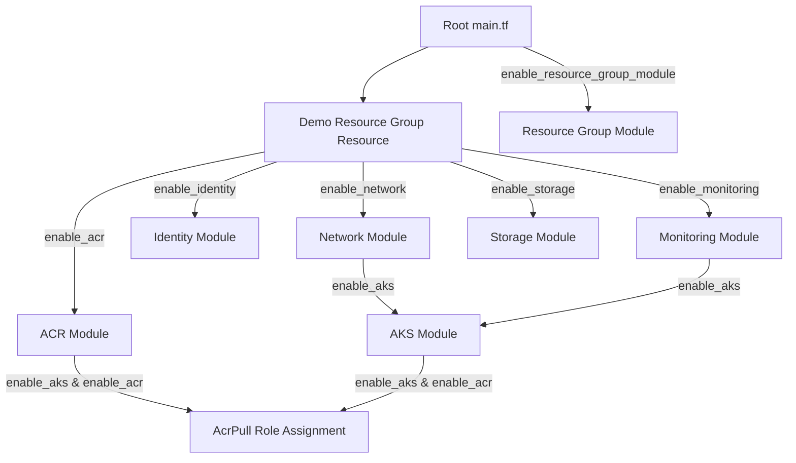
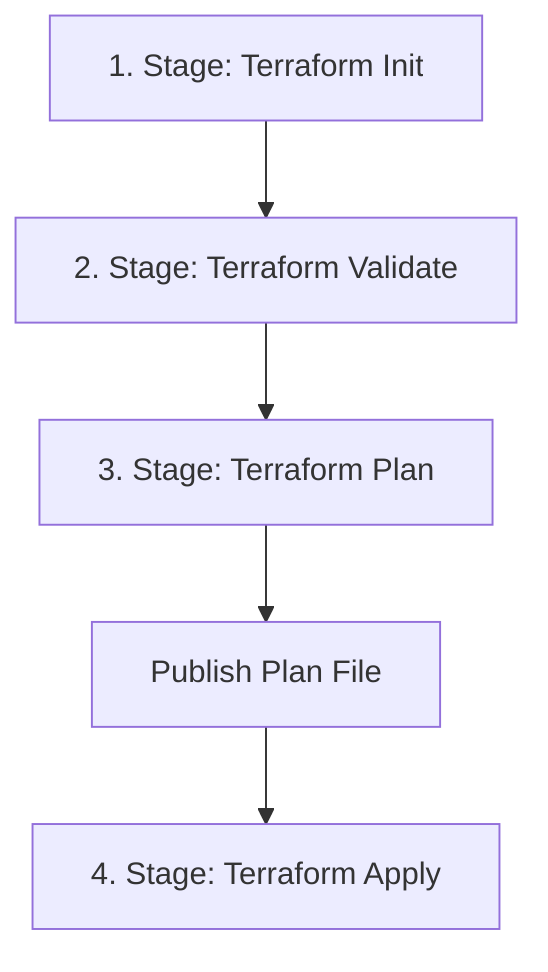

# Stage 3: Infrastructure as Code (Terraform & Pipelines) Report

This document details the modular Infrastructure as Code (IaC) blueprints and continuous integration pipelines created to provision the enterprise Azure environment for **ShipFlowX**, optimized to run under restrictive subscription policies (such as **Azure for Students** or trial accounts).

---

## 1. Directory Structure

```text
ShipFlowX/
├── terraform/
│   ├── modules/
│   │   ├── resource-group/         # Azure Resource Group boundary
│   │   │   ├── main.tf, variables.tf, outputs.tf
│   │   ├── network/                # VNet, AKS Subnet, DB Subnet, and NSG [Optional]
│   │   │   ├── main.tf, variables.tf, outputs.tf
│   │   ├── acr/                    # Container Registry [Optional]
│   │   │   ├── main.tf, variables.tf, outputs.tf
│   │   ├── aks/                    # Kubernetes Service [Optional]
│   │   │   ├── main.tf, variables.tf, outputs.tf
│   │   ├── identity/               # Managed Identity [Optional]
│   │   │   ├── main.tf, variables.tf, outputs.tf
│   │   ├── monitoring/             # Log Analytics Workspace [Optional]
│   │   │   ├── main.tf, variables.tf, outputs.tf
│   │   └── storage/                # Remote State Backend Account [Optional]
│   │       └── main.tf, variables.tf, outputs.tf
│   ├── main.tf                     # Ties modules together (supports conditional count mappings)
│   ├── variables.tf                # Global input variables with location validation
│   ├── outputs.tf                  # Global output parameters (handles null index references safely)
│   ├── locals.tf                   # Tags and naming formatting rules
│   ├── providers.tf                # azurerm provider features configuration
│   ├── versions.tf                 # Locks Terraform version (>= 1.5.0) and azurerm (v3.90.0)
│   ├── backend.tf                  # Remote state storage activation template
│   ├── terraform.tfvars            # Active variable inputs (configured with safety defaults)
│   ├── terraform.tfvars.example    # Variable input template values
│   └── README.md                   # Execution and run instructions
└── azure-pipelines.yml             # Multi-stage continuous integration pipeline
```

---

## 2. Resource & Module Architecture (Feature-Flagged)

To prevent `HTTP 403 RequestDisallowedByAzure` blocks on student accounts, we configured all resource modules (except the Resource Group) with conditional creation counts.



### Active Feature Flags
We defined the following boolean parameters inside `variables.tf` to control resource allocations:
* `enable_resource_group_module` (Default: `false`): Toggle resource group creation via the standard module.
* `enable_storage` (Default: `false`): Disables Storage accounts if blocked by policy.
* `enable_network` (Default: `false`): Disables custom VNets.
* `enable_acr` (Default: `false`): Disables Container Registries.
* `enable_monitoring` (Default: `false`): Disables Log Analytics Workspaces.
* `enable_identity` (Default: `false`): Disables Managed Identities.
* `enable_aks` (Default: `false`): Disables Kubernetes clusters.

### Demo Resource Group Fallback
To verify the deployment phase without triggering student account policy blocks, we declared a standard demo resource directly inside [main.tf](file:///c:/Users/Varun%20B/OneDrive/Desktop/Projects/ShipFlowX/terraform/main.tf):
```terraform
resource "azurerm_resource_group" "demo" {
  name     = "shipflowx-demo-rg"
  location = "East US 2"
}
```
If the standard module is disabled, all enabled sub-modules route their dependencies dynamically to `azurerm_resource_group.demo` using `local.rg_name` and `local.rg_location`.

---

## 3. Azure DevOps Multi-Stage Pipeline (`azure-pipelines.yml`)

The deployment process is split into 4 distinct jobs in Azure DevOps to ensure clear state transition logs and green checkmarks:



### Pipeline Stage Descriptions
1. **Terraform Init**: Connects to the agent container, installs dependencies, and runs `terraform init` to download provider plugins.
2. **Terraform Validate**: Runs syntax validations and reference integrity checks.
3. **Terraform Plan**: Generates the structural dry-run execution file and caches the result (`terraform plan -out=tfplan`). It publishes this plan as a **Pipeline Artifact** (`tfplan-artifact`).
4. **Terraform Apply**: Downloads the plan artifact and executes the dry-run output file (`terraform apply -auto-approve tfplan`) to guarantee that only validated plan updates are deployed.

---

## 4. DevSecOps Interview Questions

### Q1: Why do we publish and download the plan file (`tfplan`) between Plan and Apply stages in a release pipeline?
* **Answer**: If we simply ran raw `terraform apply` in the Apply stage without specifying a plan file, Terraform would generate a *new* plan on the fly and apply it. In a collaborative team setup, a developer could have modified a resource between the time the plan was reviewed and when the apply job executed, introducing unapproved modifications. Specifying the cached plan file (`tfplan`) guarantees that Terraform **only** applies the exact operations that were calculated and approved in the preceding Stage.

### Q2: How does the pipeline authenticate to Azure resource APIs?
* **Answer**: The pipeline uses an **Azure Resource Manager Service Connection** (configured under variables as `azureServiceConnection`). When the pipeline execution reaches the `AzureCLI@2` task, Azure DevOps decrypts the Service Connection credentials (client ID, client secret, tenant ID, subscription ID) and exposes them as environment variables inside the task shell, allowing the Terraform provider to authenticate securely.
