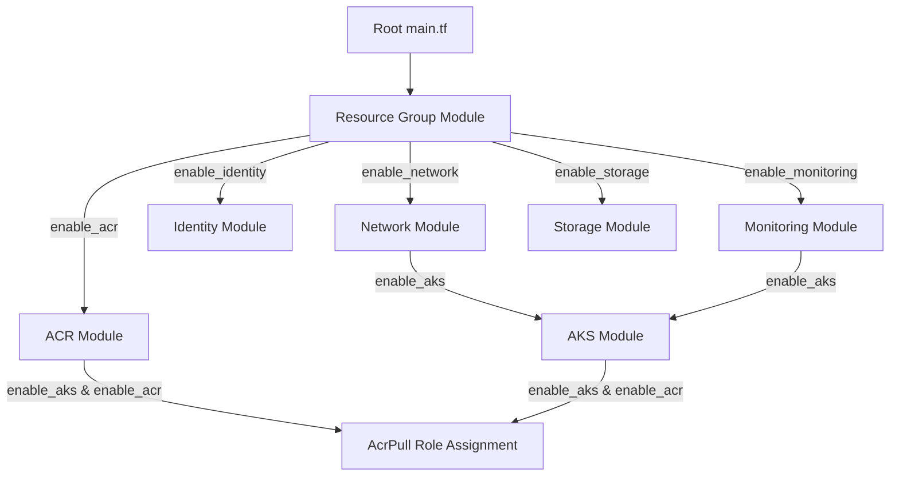

# Stage 3: Infrastructure as Code (Terraform) Report

This document details the modular Infrastructure as Code (IaC) blueprints created to provision the enterprise Azure environment for **ShipFlowX**, optimized to run under restrictive subscription policies (such as **Azure for Students** or trial accounts).

---

## 1. Directory Structure

```text
terraform/
├── modules/
│   ├── resource-group/         # Azure Resource Group boundary
│   │   ├── main.tf, variables.tf, outputs.tf
│   ├── network/                # VNet, AKS Subnet, DB Subnet, and NSG [Optional]
│   │   ├── main.tf, variables.tf, outputs.tf
│   ├── acr/                    # Container Registry [Optional]
│   │   ├── main.tf, variables.tf, outputs.tf
│   ├── aks/                    # Kubernetes Service [Optional]
│   │   ├── main.tf, variables.tf, outputs.tf
│   ├── identity/               # Managed Identity [Optional]
│   │   ├── main.tf, variables.tf, outputs.tf
│   ├── monitoring/             # Log Analytics Workspace [Optional]
│   │   ├── main.tf, variables.tf, outputs.tf
│   └── storage/                # Remote State Backend Account [Optional]
│       └── main.tf, variables.tf, outputs.tf
├── main.tf                     # Calls and ties modules together (supports conditional count mappings)
├── variables.tf                # Global input variables with location validation
├── outputs.tf                  # Global output parameters (handles null index references safely)
├── locals.tf                   # Tags and naming formatting rules
├── providers.tf                # azurerm provider features configuration
├── versions.tf                 # Locks Terraform version (>= 1.5.0) and azurerm (v3.90.0)
├── backend.tf                  # Remote state storage activation template
├── terraform.tfvars            # Active variable inputs (configured with safety defaults)
├── terraform.tfvars.example    # Variable input template values
└── README.md                   # Execution and run instructions
```

---

## 2. Resource & Module Architecture (Feature-Flagged)

To prevent `HTTP 403 RequestDisallowedByAzure` blocks on student accounts, we configured all resource modules (except the Resource Group) with conditional creation counts.



### Active Feature Flags
We defined the following boolean parameters inside `variables.tf` to control resource allocations:
* `enable_storage` (Default: `false`): Disables Storage accounts if blocked by policy.
* `enable_network` (Default: `false`): Disables custom VNets. If AKS is run with network disabled, Azure defaults to Microsoft-managed subnets.
* `enable_acr` (Default: `false`): Disables Container Registries.
* `enable_monitoring` (Default: `false`): Disables Log Analytics Workspaces to preserve regional logging quotas.
* `enable_identity` (Default: `false`): Disables Managed Identities.
* `enable_aks` (Default: `false`): Disables Kubernetes VM scale sets to prevent virtual CPU core limit exclusions.

---

## 3. Location Validation & Geographies

Student subscriptions enforce rigid regional permissions. We centralized all region assignments under the `location` variable, set its default to **`centralindia`**, and added a strict validation constraint block:
```terraform
validation {
  condition     = contains(["centralindia", "eastus", "eastus2", "westus", "westus2", "westeurope", "northeurope", "southeastasia"], var.location)
  message       = "The location must be one of the allowed Azure regions: centralindia, eastus, eastus2, westus, westus2, westeurope, northeurope, southeastasia."
}
```

---

## 4. Key Security Integrations (IAM Role Assignments)

* **Conditional AcrPull**: The role assignment `azurerm_role_assignment.aks_acr_pull` uses a conditional check:
  `count = var.enable_aks && var.enable_acr ? 1 : 0`
  It is only created if both the cluster and the container registry modules are active.
* **Safe Outputs rendering**: Outputs in `outputs.tf` use array length guards (e.g. `var.enable_aks ? (length(module.aks) > 0 ? module.aks[0].name : null) : null`) to avoid indexing errors when flags are set to `false`.

---

## 5. DevSecOps Interview Questions

### Q1: How does Terraform handle references between resources when modules are conditionally disabled (count = 0)?
* **Answer**: If a module has `count = 0`, referencing its outputs directly (e.g. `module.aks.name` or `module.aks[0].name`) will throw a compile-time block error because index `0` does not exist in the collection. To avoid this, we must use conditional checks or element fallback checks like `var.enable_aks ? module.aks[0].name : null`. Using Terraform's `one(module.aks[*].name)` function is another way to safely extract values from collection lists.

### Q2: What causes `RequestDisallowedByAzure` errors on student subscriptions?
* **Answer**: Student subscriptions are linked to free-tier educational quotas. Azure administrators enforce Azure Policies at the subscription scope. These policies:
  1. Restrict the creation of expensive resources (like standard Container Registries or GPU-enabled VM instances).
  2. Enforce region locks (e.g., resources can only be created in specific zones like Central India or East US).
  3. Limit the total number of CPU cores across the account.
  Using Terraform feature flags is the industry-standard way to selectively disable restricted components during testing while keeping the overall code structure enterprise-ready.
