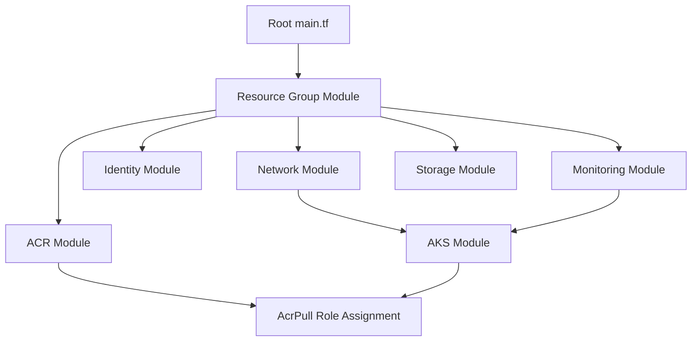
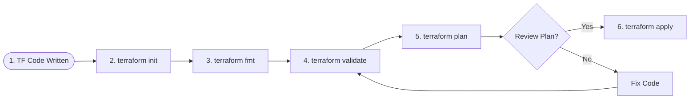

# Stage 3: Infrastructure as Code (Terraform) Report

This document details the modular Infrastructure as Code (IaC) blueprints created to provision the enterprise Azure environment for **ShipFlowX**.

---

## 1. Directory Structure

```text
terraform/
├── modules/
│   ├── resource-group/         # Azure Resource Group boundary
│   │   ├── main.tf, variables.tf, outputs.tf
│   ├── network/                # VNet, AKS Subnet, DB Subnet, and NSG
│   │   ├── main.tf, variables.tf, outputs.tf
│   ├── acr/                    # Container Registry
│   │   ├── main.tf, variables.tf, outputs.tf
│   ├── aks/                    # Kubernetes Service
│   │   ├── main.tf, variables.tf, outputs.tf
│   ├── identity/               # Managed Identity
│   │   ├── main.tf, variables.tf, outputs.tf
│   ├── monitoring/             # Log Analytics
│   │   ├── main.tf, variables.tf, outputs.tf
│   └── storage/                # Remote State Backend Account
│       └── main.tf, variables.tf, outputs.tf
├── main.tf                     # Calls and ties modules together
├── variables.tf                # Global input variables
├── outputs.tf                  # Global output parameters
├── locals.tf                   # Tags and naming formatting rules
├── providers.tf                # azurerm provider details
├── versions.tf                 # Locks Terraform & Provider versions
├── backend.tf                  # Remote state template config
├── terraform.tfvars.example    # Variable input template values
└── README.md                   # Execution and run instructions
```

---

## 2. Resource & Module Architecture

Our architecture separates infrastructure into isolated, single-responsibility modules:



### Module Descriptions
1. **Resource Group**: Establishes a logical lifecycle boundary for all ShipFlowX assets.
2. **Network**: Configures a Virtual Network (`10.240.0.0/16`) divided into:
   * `aks-subnet` (`10.240.0.0/20`): Sized for CNI network pod IPs and cluster nodes.
   * `db-subnet` (`10.240.16.0/24`): Isolated subnet for backend data storage layers.
   * Configures a Network Security Group (NSG) restricting inbound access to database subnets.
3. **Azure Container Registry (ACR)**: A secure container image repository (Standard SKU).
4. **Azure Kubernetes Service (AKS)**: High-availability managed Kubernetes cluster running system VM nodes inside the custom VNet. Configured using **Azure CNI** networking (each pod receives a native VNet IP address) and linked to Log Analytics.
5. **Managed Identity**: Provisions a User-Assigned Managed Identity to act as the primary runtime identity profile.
6. **Monitoring**: Provisions a Log Analytics Workspace that collects Kubernetes container stdout/stderr, cluster node logs, and system metrics.
7. **Storage**: Provision a Storage Account and Blob Container. Prepared to serve as the secure remote state backend.

---

## 3. Top-Level Workflow

The diagram below outlines the deployment lifecycle of the Terraform state:



---

## 4. Key Security Integrations (IAM Role Assignments)

To maintain a zero-trust model, we integrated role assignments using least-privilege access rules:
* **AcrPull Role Binding**: We link the AKS cluster's Kubelet managed identity (`kubelet_identity[0].object_id`) to the ACR registry with the `AcrPull` role. This allows Kubernetes nodes to pull private images securely over Microsoft's backbone network without exposing public admin credentials on the registry.
* **Network Isolation**: The Database subnet is locked down via NSG rules, ensuring only pods within the AKS cluster subnet can initiate connections to the database ports.

---

## 5. DevSecOps Interview Questions

### Q1: What is the difference between Azure CNI and Kubenet network plugins in AKS?
* **Answer**: Kubenet is a basic networking plugin where pods receive IP addresses from a private network namespace inside the node, and the node performs Network Address Translation (NAT) to access VNet resources. This limits visibility and network performance. **Azure CNI** (Container Network Interface) allocates IPs directly from the Azure Virtual Network (VNet) to every pod. This enables native communication without NAT, supports advanced network security policies (NSGs), and makes pods directly accessible by other VNet services, though it requires larger subnet address blocks.

### Q2: Why should we lock provider versions using `versions.tf` in enterprise projects?
* **Answer**: Terraform providers are continuously updated by vendors. If you do not lock provider versions (e.g., `version = "~> 3.90.0"`), Terraform will download the latest release during `terraform init`. A minor or major update can introduce breaking changes in resource schemas (such as removing a field or modifying a resource default), which could corrupt the state file or cause production deployments to fail. Locking ensures all developers and CI/CD pipelines compile with the exact same codebase conditions.

---

## 6. Common Mistakes to Avoid

* **Storing State Locally**: Keeping the `terraform.tfstate` file on local disks. This prevents team collaboration, as the state file acts as the single source of truth. If multiple developers run plans concurrently, they will corrupt resources. We prepare a dedicated Azure Storage Account Blob Container backend to store state files with automatic file locking.
* **Hardcoded Resource Credentials**: Hardcoding subscription IDs, client secrets, or passwords inside `.tf` files. We use variables, `.tfvars` (ignored by Git), or environment variables (`ARM_CLIENT_ID`, `ARM_CLIENT_SECRET`) to authenticate pipelines.
